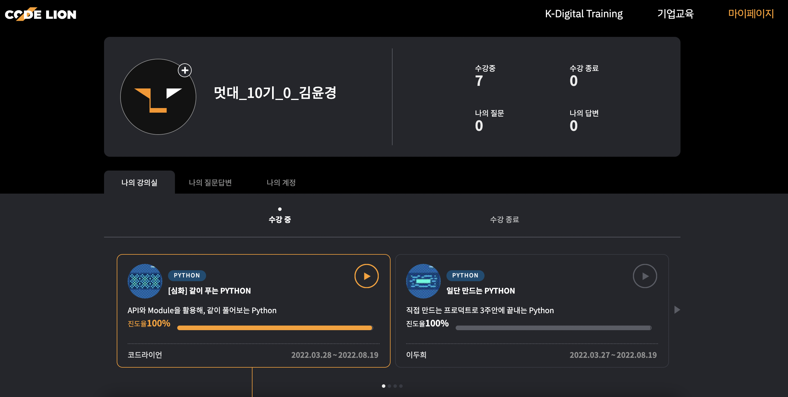

# 파이썬 심화
## 코드라이언: 같이 푸는 PYTHON

<br>


<br>

## **Web Crawler**
웹 페이지의 데이터를 모아주는 소프트웨어

<br>

## **Web Crawling**
크롤러를 사용해 웹 페이지의 데이터를 추출해내는 행위

<br>

## **requests 모듈**
`import requests`


<br>

## **BeautifulSoup 모듈**
- HTML정보로 부터 원하는 데이터를 가져오기 쉽게, 비슷한 분류의 데이터별로 나누어주는(parsing) 파이썬 라이브러리

<br>

`BeautifulSoup(데이터, 파싱 방법)`
- BeautifulSoup(markup, 'html.parser')
- BeautifulSoup(markup, 'lxml')
- BeautifulSoup(markup, 'xml')
- BeautifulSoup(markup, 'html5lib')

<br>

**원하는 HTML 태그 찾아서 불러오기**
- 조건에 맞는 태그가 1개 이상이면, 첫 번째 태그를 가져온다.
```python
# bs에서 <p> 태그로 감싸져 있는 부분 찾기
p = bs.find('p')

# class명 찾기
class = bs.find('div', class='ex_class')

# id 찾기
id = bs.find('div', id='ex_id')
```

<br>

**원하는 HTML 태그 전부 불러오기**
```python
# bs에서 <p> 태그로 감싸진 부분 전부가져오기 ( list 형식으로 저장 )
p = bs.find_all('p')

# class 전부 찾기
class = bs.find_all('div', class='ex_class')

# id 전부 찾기
id = bs.find_all('div', class='ex_id')
```

<br>

**가져온 정보 출력하기**
```python
# 위의 내용과 이어집니다

# 태그이름 출력 ( p )
print(p.name)

# class명 출력
print(class['class']

# id명 출력
print(id['id'])
```

<br>

## **API**
- API는 정의 및 프로토콜 집합을 사용하여 두 소프트웨어 구성 요소가 서로 통신할 수 있게 하는 메커니즘이다.
- API의 맥락에서 애플리케이션이라는 단어는 고유한 기능을 가진 모든 소프트웨어를 나타낸다. 인터페이스는 두 애플리케이션 간의 서비스 계약이라고 할 수 있다. <br> 이 계약은 요청과 응답을 사용하여 두 애플리케이션이 서로 통신하는 방법을 정의한다. API 문서에는 개발자가 이러한 요청과 응답을 구성하는 방법에 대한 정보가 들어 있다.


<br>

## **googletrans 모듈**
`translator = Translator()`
<br>
translator라는 변수에 Translator() 객체를 집어넣는다.

<br>

`translator.translate(번역하고자 하는 문자, dest="변경하고자 하는 언어 키")`

<br>

## **smtplib 모듈**
이메일을 송신할때 사용하는 모듈

<br>

- email 모듈을 이용하여 발송할 메시지를 작성한다. 메시지는 파일을 첨부해야 하기 때문에 MIMEMultipart 클래스를 사용해야 한다.

```python
from email.mime.multipart import MIMEMultipart

msg = MIMEMultipart()
```

<br>

- 생성한 메시지 객체에 보내는 사람과 받는 사람을 설정한다.
```python
msg['From'] = '메일 주소'
msg['To'] = '메일 주소'
```


참고: https://wikidocs.net/130932